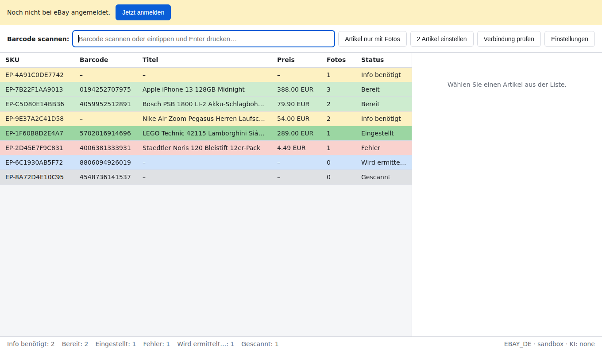
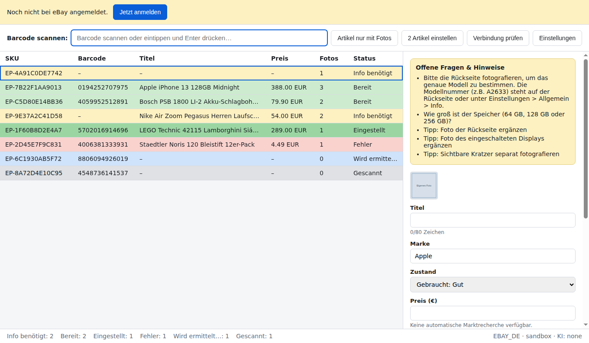

# ePay Tool

Electron desktop application that turns a barcode scan into a
ready-to-publish eBay.de listing, so a seller can prepare and post 100+
products a day instead of researching each one by hand.

The user scans a barcode, the app looks the product up, researches the
market price, fills in the listing form, and shows it for review. One
click publishes it. When the product cannot be identified automatically,
an AI assistant identifies what it can from photos and **asks for the
missing details** instead of guessing.

📄 **[Product documentation (PDF, German)](docs/ePay-Tool-Dokumentation.pdf)** —
illustrated walkthrough for the customer.



## How it works

```
barcode scan ─┬─► eBay Catalog API ──► exact product data (title, brand, aspects, images)
              │        (miss)
              └─► AI vision fallback ──► identification + confidence + open questions
                                │
                                ▼
                       eBay Taxonomy API ──► category + required item specifics
                                │
                                ▼
                       eBay Browse API ────► market prices ──► suggested price
                                │
                                ▼
                       completeness check ──► READY  or  NEEDS_INFO
                                │
                                ▼ (one click)
                       eBay Inventory API ──► published listing
```

The important design decision: **eBay's own APIs do the identification
wherever possible.** For a product with a barcode in eBay's catalog, no
AI is involved at all — the result is instant, free and exact. AI is the
fallback for unlisted, used or unboxed goods, plus a quality assistant on
top.

### The AI asks instead of guessing

Every AI answer carries a per-field confidence score. Fields below the
threshold never reach the listing; they become questions in the review
panel:

> Bitte die Rückseite fotografieren, um das Modell zu bestimmen.
> (Modellnummer steht auf der Rückseite oder unter Einstellungen →
> Allgemein → Info.)

This is what handles the hard cases — a front photo of a phone cannot
reveal which model it is, and a shoe photo without the tongue label
cannot reveal the size. The app says so rather than inventing an answer.



Whether a draft may be posted is decided by deterministic rules in
`src/main/core/quality.ts`, never by the model. The AI only contributes
non-blocking suggestions.

## Product queue

Every scanned item lives in a local SQLite queue with an explicit state,
so a large batch survives restarts and can be worked through at any pace:

| State | Meaning |
| --- | --- |
| `SCANNED` | captured, not yet processed |
| `ENRICHING` | lookup, pricing and AI running in the background |
| `NEEDS_INFO` | open questions or missing required fields |
| `READY` | complete draft — one click from publishing |
| `POSTED` | live on eBay |
| `FAILED` | last operation failed, can be retried |

Enrichment runs on a bounded queue in the main process, so scanning never
blocks the UI and a single failing product never stops the batch.

## Setup

Requires **Node.js 22 or newer** (the main process uses Node's built-in
SQLite module).

```bash
npm install
cp .env.example .env      # then fill in the values
npm run dev
```

### eBay credentials

**→ Full walkthrough: [docs/SETUP-EBAY.md](docs/SETUP-EBAY.md)** — including
which APIs need extra approval and what it all costs (the APIs are free).

Short version:

1. Create an application at <https://developer.ebay.com> (free) and copy
   the App ID (client id), Cert ID (client secret) and RuName. You need
   your own developer account — a customer cannot transfer API access,
   he only grants your app permission to his seller account.
2. Set the application's **accept URL** to
   `http://localhost:8123/callback` so the desktop login flow can capture
   the authorization code.
3. Start with `EPAY_EBAY_ENV=sandbox`; switch to `production` once the
   flow is verified.
4. Run `npm run doctor` — it checks every step and says what is missing.

The first launch shows a sign-in banner and opens a browser for the
one-time eBay consent. The resulting refresh token is encrypted with
Electron's `safeStorage`, which is backed by the OS credential store
(DPAPI on Windows, Keychain on macOS) — it is never written in plain
text.

Before publishing, open **Einstellungen** once and select the shipping,
payment and return policies to use — eBay requires all three on every
offer.

### AI provider

| Provider | Setting | Notes |
| --- | --- | --- |
| Google Gemini | `EPAY_AI_PROVIDER=gemini` | Recommended. Free tier is enough for development; production is a few euros a month at 100+ products/day. |
| Ollama (local) | `EPAY_AI_PROVIDER=ollama` | Free and offline, needs a strong PC, weaker at fine-grained identification. |
| None | `EPAY_AI_PROVIDER=none` | Barcode-only mode; catalog matches still work. |

The provider sits behind a single interface (`src/main/ai/provider.ts`),
so switching or adding a model is a config change rather than a
refactor. A missing or invalid API key does not stop the app: it starts
without AI, shows a banner, and barcode lookups keep working.

## Development

```bash
npm run dev         # run the app with hot reload
npm test            # unit tests (no network, no credentials needed)
npm run typecheck
npm run lint
npm run smoke       # boots the built app and checks the IPC bridge and UI
npm run doctor      # checks the live eBay connection step by step
```

Tests use fake eBay and AI backends, so the suite never touches the
network. `npm run smoke` runs after `npm run build` and catches the class
of failure unit tests cannot see — a preload that does not load, or a
renderer that throws on boot.

## Building the desktop app

Run on the target platform — electron-builder does not cross-compile.

```bash
npm run package:win     # dist/ePay Tool-0.1.0-setup.exe
npm run package:mac     # dist/ePay Tool-0.1.0-<arch>.dmg  (x64 + arm64)
```

There are no native modules, so there is no per-ABI rebuild step and
nothing extra to code-sign.

## Layout

```
src/
  main/         Electron main process (all privileged work)
    ai/         provider interface, Gemini + Ollama backends, prompts, schemas
    core/       pipeline, pricing, quality rules, bounded task queue
    db/         SQLite schema and product repository
    ebay/       OAuth, HTTP client, Catalog/Taxonomy/Browse/Inventory/Media
  preload/      context-isolated IPC bridge
  renderer/     React UI: scan bar, review grid, detail panel, settings
  shared/       types and IPC contract used by both sides
```

The renderer runs with `contextIsolation` on and `nodeIntegration` off;
it reaches the filesystem, database and network only through the typed
channels in `src/shared/ipc.ts`.

## Known limits

- **Catalog coverage varies by category.** Excellent for electronics and
  media, weaker for clothing and no-name goods. Test with real inventory
  early.
- **Price research uses asking prices**, not sold prices. Actual sold
  data needs eBay's Marketplace Insights API, which requires separate
  approval; `src/main/ebay/browse.ts` is the place to plug it in.
- **Used goods need real photos.** Catalog stock images are used only
  when the seller supplies none, and the app warns when a non-new item
  has no photos of its own.
- **Node's SQLite module is still marked experimental** upstream. It is
  confined to `src/main/db/`, so swapping in `better-sqlite3` would touch
  only those two files.
